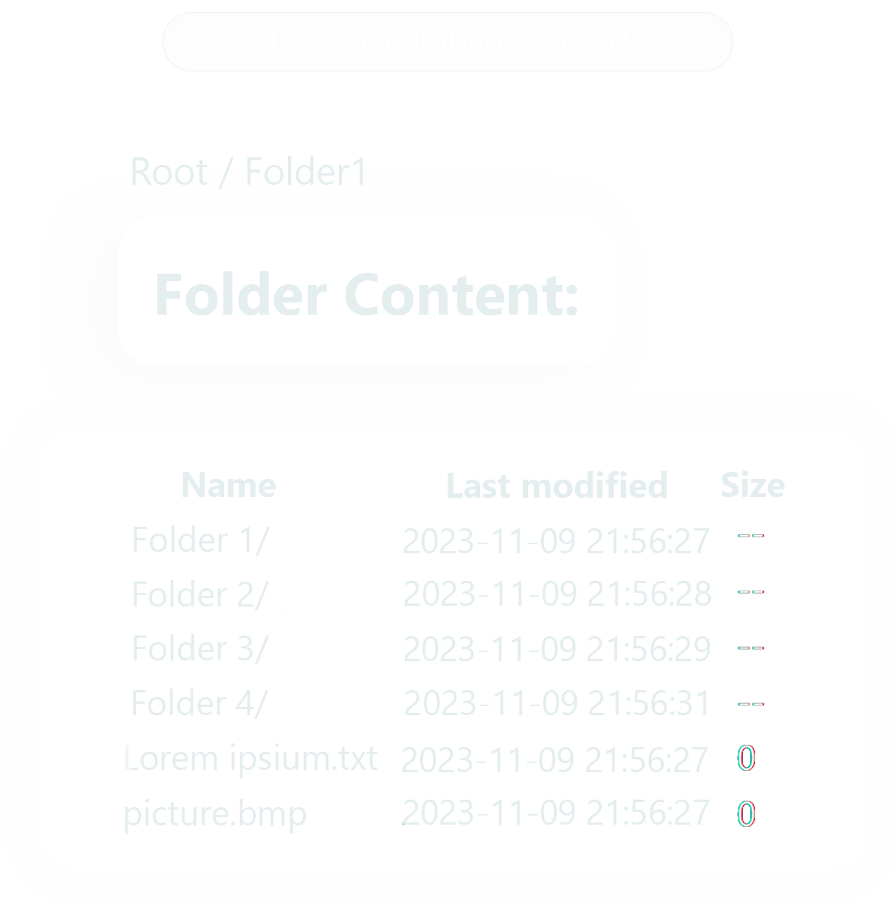
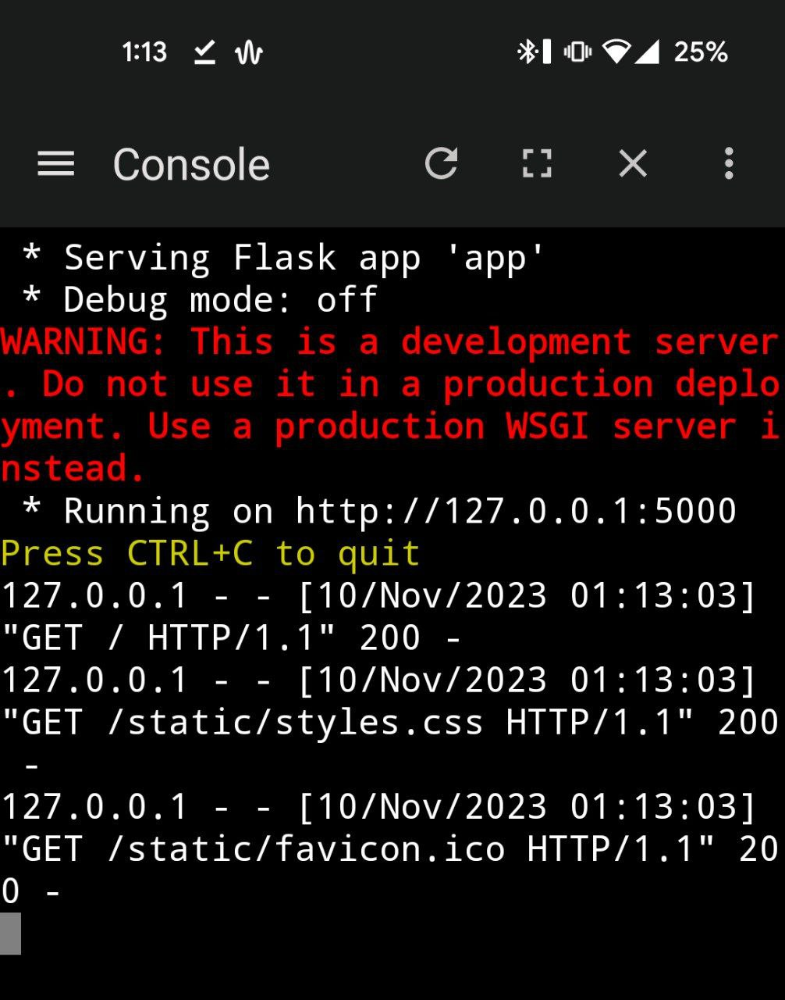
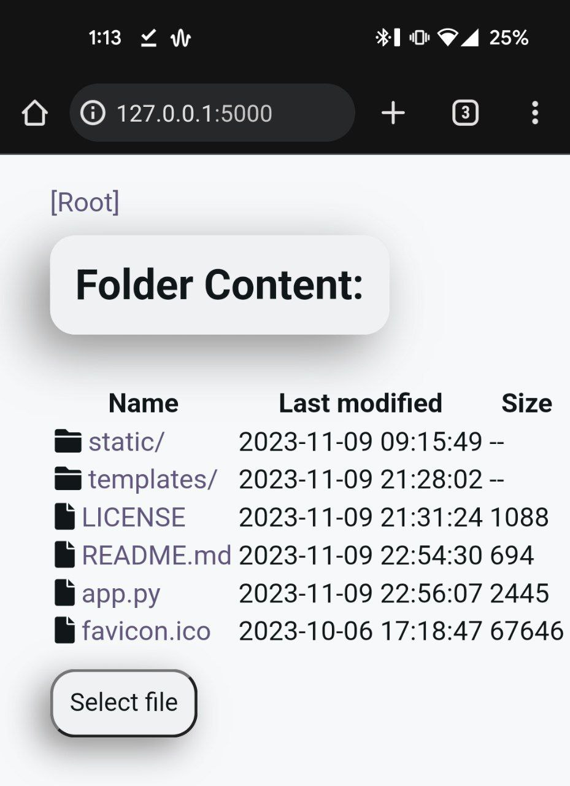

<a name="readme-top"></a>
<a name="Simple http server"></a>
<br />
<div>
    <div align="center">
  
      
</div>

### Simple http css server in Python (Windows/Mac/Linux/Android)


## Basic Features 

-  Ability to view / download / upload files
-  Ability to easily change page colors to suit your needs in css variables 

## Screenshot
<div align="center">

<details>
  <summary>Android deployment example</summary>




</details>
</div>

## Command Line Arguments
```
Simple HTTP Server 0.0.2

USAGE:
Install flask with 'pip'
In command line type 'python app.py [FLAG] [--]'


FLAGS:
        --ip <ip>                            IP address to build [default: 127.0.0.1]
        --port <port>                        Port number [default: 5000]
        --silent                             No output to console
        --help                               Guess what)

```
## Build
You can build the project into a standalone executable file by following these steps:

```bash

#get project
git clone https://github.com/badmodest/simple-python-http-server.git

pip install lief
#installation of **lief** is not necessary, as it is installed together with cx-freeze.

pip install cx-freeze

python setup.py build
#Inside setup.py, you can change the name of the output file, or add new dependencies

cd ./build/exe.win-amd64-3.11/
run PyHTTP.exe [FLAGS] [--]
# Name of executable  may be different


```
## TODO
- [ ] Get rid of the presence of the Flask library, and deploy python capabilities
- [ ] Ability to build into a single executable file
- [ ] Implement cgi support
- [ ] Ability to change sorting
- [ ] HTTP Basic Authorization
- [ ] Upload file size limit
- [ ] Support `TSL/SSL` 
- [ ] Support `IPv6`
- [ ] Ability to disable file uploading
- [ ] Toggle theme
- [ ] Improve basic formatting and positioning of information on the page

> [!WARNING]
> Right now, I don't recommend deploying on machines with a public external IP, as there is no data protection and a malicious user can access it.


[Back to Top](#readme-top)


