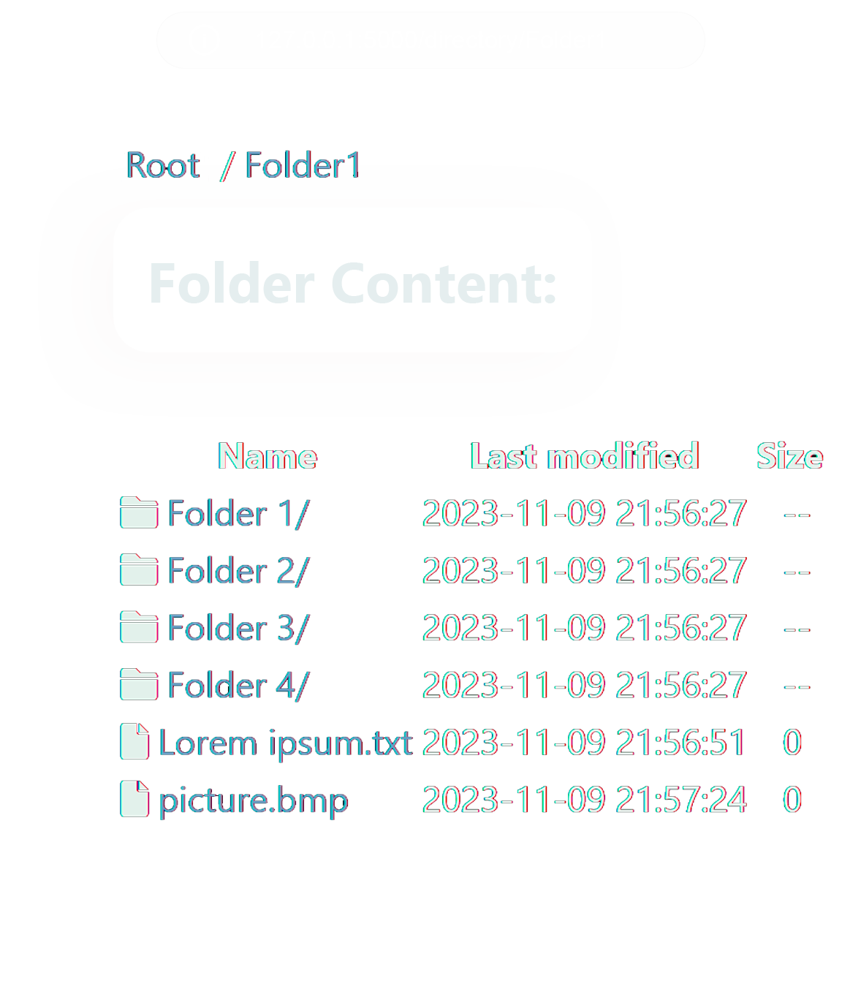

<a name="readme-top"></a>
<a name="Simple http server"></a>
<br />
<div>
    <div align="center">
  
      <h2>Simple http css server in Python (Windows/Mac/Linux/Android)</h2>
</div>


## Basic Features 

-  Ability to view / download / upload files
-  Ability to easily change page colors to suit your needs in css variables 

## Screenshot

<details>
  <summary>Android Example</summary>


</details>


## Command Line Arguments
```
Simple HTTP Server 0.0.2

USAGE:
Install flask with 'pip'
In command line type 'python app.py [FLAG] [--]'


FLAGS:
        --ip <ip>                            IP address to build [default: 127.0.0.1]
        --port <port>                        Port number [default: 5000]
        --silent                             No output to console
        --help                               Guess what)

```
## TODO
- [ ] Get rid of the presence of the Flask library, and deploy python capabilities
- [ ] Implement cgi support
- [ ] Ability to change sorting
- [ ] HTTP Basic Auth
- [ ] Upload file size limit
- [ ] Support `TSL/SSL` 
- [ ] Support `IPv6`
- [ ] Ability to disable file uploading
- [ ] Toggle theme

      
[Back to Top](#readme-top)


